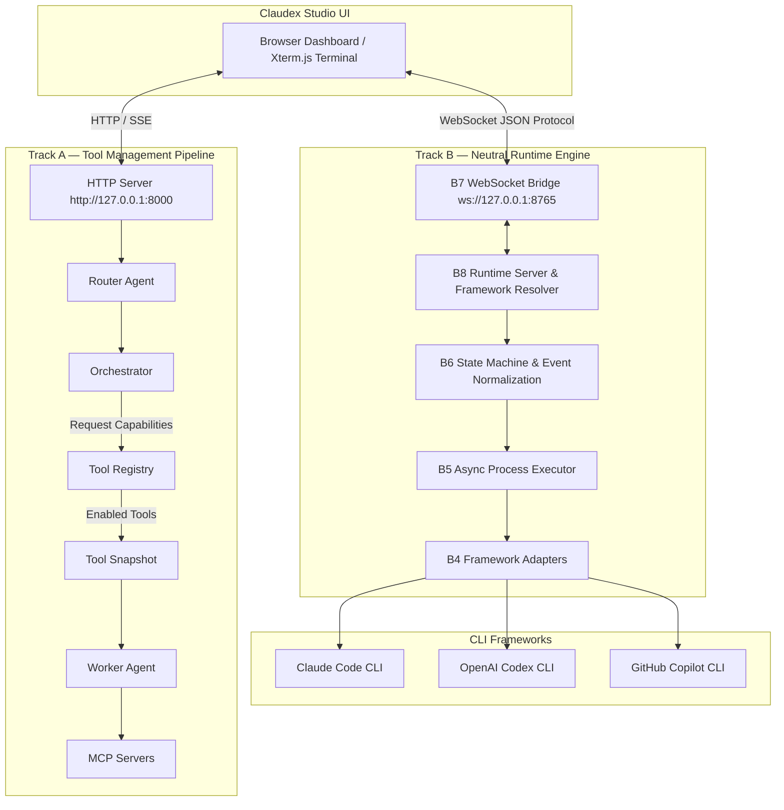

# Jarvis / Claudex Studio

A modular, multi-agent personal AI assistant and framework-neutral coding-agent runtime powered by **Model Context Protocol (MCP)**, featuring dynamic tool orchestration, a robust Tool Registry, and **Claudex Studio** — a split-screen dashboard for controlling external CLI coding agents (**Claude Code**, **OpenAI Codex**, and **GitHub Copilot CLI**).

---

## Overview

Jarvis combines a capability-based multi-agent system with a provider-neutral CLI orchestration engine:

1. **Track A (Tool Management Pipeline)**: Solves the large-catalog tool selection problem for ~120+ MCP tools. It uses a capability-based multi-agent architecture (Router → Orchestrator → Worker) backed by an immutable Tool Registry and snapshot system to avoid overwhelming LLM context windows.
2. **Track B (Neutral Runtime Engine & Claudex Studio)**: Provides a process-neutral execution stack to launch, observe, control, and terminate CLI coding agents (Claude Code, OpenAI Codex, GitHub Copilot) through a unified state machine, WebSocket transport bridge, and Xterm.js browser UI.

---

## Architecture



---

## Track A — Tool Management & Multi-Agent Pipeline

Track A establishes a provider-agnostic tool pipeline capable of scaling to hundreds of MCP tools with high recall and precision:

```text
User Request → Router → Discovery → Selection → Tool Snapshot → Worker → Execution Gateway → MCP Tools
```

* **Router Agent**: Analyzes requests, answers simple queries directly, or delegates complex tasks requiring tools or web research.
* **Tool Registry (`app/tools/registry.py`)**: Centralized source of truth tracking MCP tool metadata, server origins, capability buckets, and availability states.
* **Discovery & Selection Engine (`app/tools/discovery.py`, `app/tools/selector.py`)**: Performs semantic and keyword-based tool retrieval to filter candidates deterministically before model invocation.
* **Immutable Tool Snapshots (`app/tools/models.py`)**: Guarantees workers operate strictly on an isolated, minimal subset of eligible tools for the given task.
* **Tool Search Evaluation Suite (`app/tools/evaluation.py`)**: Built-in benchmark suite measuring discovery recall, selection precision, and overexposure rates across standard multi-step and ambiguous test cases.

### Supported MCP Capabilities

| Capability | MCP Servers | Description |
| --- | --- | --- |
| `web_research` | Exa, Tavily, Firecrawl | Web search, content extraction, and page scraping. |
| `browser_automation` | Playwright | Headless/visual browser automation. |
| `messaging` | WhatsApp | Read, search, and send WhatsApp messages. |
| `filesystem` | Filesystem | Local file reads, writes, directory listings, and edits. |
| `memory` | Memory | Long-term knowledge graph node creation and querying. |
| `terminal` | Terminal | Command-line execution within safe boundaries. |

---

## Track B — Neutral Runtime Engine & Claudex Studio

Track B provides a provider-neutral, event-driven runtime stack that abstracts external coding-agent CLIs into a unified control plane.

### Core Components (`app/runtime/`)

* **B4 Neutral Runtime Contract (`contract.py`, `adapters/`)**: Abstract boundaries (`RuntimeConfig`, `FrameworkAdapter`) isolating framework-specific CLI flags, parameters, and environment overrides.
  * **Claude Adapter**: Maps non-interactive execution (`-p` / `--print`), model flags, and Anthropic API keys.
  * **Codex Adapter**: Manages `exec` subcommands, `--oss --local-provider ollama` local model routes, and TOML `-c` overrides.
  * **Copilot Adapter**: Maps non-interactive prompt flags (`-p` / `--prompt`), `--allow-all-tools`, and `COPILOT_GITHUB_TOKEN` propagation.
* **B5 Process Executor (`executor.py`)**: Asynchronous process management wrapper around `asyncio.subprocess` controlling stdin/stdout/stderr streaming, cancellation, and termination signals.
* **B6 Event Normalization & State Machine (`runtime.py`)**: Deterministic state machine managing execution states:
  $$\text{IDLE} \rightarrow \text{STARTING} \rightarrow \text{RUNNING} \rightarrow \{\text{WAITING\_FOR\_INPUT}, \text{WAITING\_FOR\_APPROVAL}\} \rightarrow \text{COMPLETED} \mid \text{FAILED} \mid \text{CANCELLED}$$
  Normalizes raw process signals into structured `RuntimeSessionEvent` JSON objects.
* **B7 WebSocket Bridge (`websocket.py`)**: Asynchronous, multi-client transport bridge (`ws://127.0.0.1:8765`) supporting session subscription, text input forwarding, user approval handling, and cancellation via stable `run_id` routing.
* **B8 Runtime Server (`server.py`)**: Local session manager, framework resolver, and terminal-state monitor ensuring clean process shutdown and event grace periods.
* **B10–B12 Claudex Studio UI (`claudex-studio/`)**: Split-screen web dashboard:
  * **Left Panel (40%)**: Framework identity, session status badge, model/provider info, execution timing metrics, line counts, and prompt input controls.
  * **Right Panel (60%)**: Interactive **Xterm.js** terminal emulator providing real-time ANSI stream rendering and keyboard input forwarding.

---

## Repository Structure

```text
JarvisMCP/
├── app/
│   ├── agents/            # Router, Orchestrator, Planner, & Worker agents
│   ├── bookkeeping/       # Usage tracking & token consumption monitoring
│   ├── llm/               # LLM provider adapters (Ollama, Gemini, OpenAI, Anthropic)
│   ├── mcp/               # MCP client handlers
│   ├── runtime/           # Track B Neutral Runtime Engine
│   │   ├── adapters/      # Framework Adapters (Claude, Codex, Copilot)
│   │   ├── contract.py    # RuntimeConfig & FrameworkAdapter contract
│   │   ├── events.py      # Raw & normalized event models
│   │   ├── executor.py    # B5 Async Process Executor
│   │   ├── runtime.py     # B6 State Machine & Session Orchestrator
│   │   ├── server.py      # B8 Local Runtime Server
│   │   └── websocket.py   # B7 WebSocket Runtime Bridge
│   ├── tools/             # Track A Tool Registry, Discovery, & Selector Engine
│   └── server.py          # HTTP / SSE server entrypoint
├── claudex-studio/        # Claudex Studio browser frontend (HTML/CSS/JS + Xterm.js)
├── Implementation_Reports/# Comprehensive design & validation reports (Track A & Track B)
├── main.py                # Combined application entrypoint
└── requirements.txt       # Python dependencies
```

---

## Quick Start

### 1. Prerequisites

* **Python 3.10+** (Python 3.14 supported)
* **Node.js** (optional, required if invoking npm-installed CLIs like Claude Code or Copilot CLI)
* **uv** (recommended Python package installer)

### 2. Environment Setup

Copy `.env.example` to `.env` and supply your API keys or local endpoint paths:

```env
# LLM Providers
JARVIS_ROUTER_PROVIDER=gemini
JARVIS_WORKER_PROVIDER=ollama
GEMINI_API_KEY=your_gemini_api_key

# MCP Servers Configuration
WHATSAPP_MCP_TRANSPORT=stdio
```

### 3. Running Jarvis & Claudex Studio

Launch the combined application server:

```bash
python main.py
```

This single command starts:
1. **HTTP Web Application**: `http://127.0.0.1:8000` (Navigating to `/` automatically redirects to `/claudex-studio/`).
2. **Runtime WebSocket Server**: `ws://127.0.0.1:8765`.

Open `http://127.0.0.1:8000` in your web browser to access **Claudex Studio**.

---

## Testing & Validation

### Run Runtime Engine Tests

```bash
python -m pytest app/runtime -q
```

### Run Full Application Test Suite

```bash
python -m pytest app/ -q
```

### Run Claudex Studio Frontend Tests

```bash
node --test claudex-studio/*.test.js
```

---

## License

MIT License
